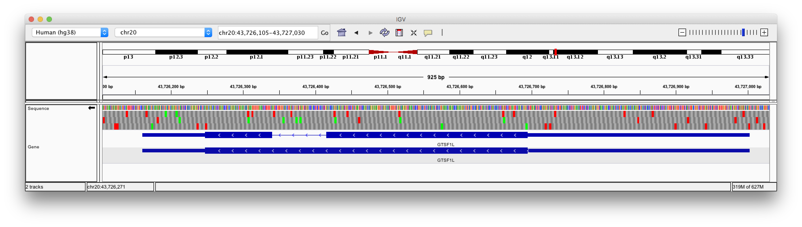

## Flavours of R

### Base R

Functions and types that are always available in R.

### CRAN (14,917 packages as at September 2019)

"Comprehensive R Archive Network" - main source of R packages

```{r eval=F}
# Example
install.packages("glmnet")
install.packages("tidyverse")
```

### Bioconductor (1,741 packages as at September 2019)

```{r eval=F}
# Setup
install.packages("BiocManager")

# Install a Bioconductor package
BiocManager::install("limma")

# Check for out-of-date packages
BiocManager::install()
```


## What Bioconductor is for

**Differential expression analysis from microarray or RNA-seq**

* `limma`, `edgeR`, `DESeq2`, ...
* Further packages to normalize, impute, batch correct, check quality, ...

**Visualization**

* `ComplexHeatmap`, `Gviz`, `ggbio`, ...

**Peaks, regions, motifs in genome** (eg for ChIP-seq, ATAC-seq)

* `GenomicRanges`, `GenomicFeatures`, ...

**Single-cell sequencing**

**Statistical methods for $p \gg n$ data**

...


## More types

Can do a lot in R with vectors and data frames.

To use Bioconductor, familiarity with several further types are important.

* `matrix`, `list`
* `DNAString`, `DNAStringSet`
* `GRanges`
* Others: `SeqInfo`, `TxDb`, `EnsDb`, `OrgDb`, `VCF`, `SummarizedExperiment`, `DelayedArray`, ...

## S4 types

Most base R packages use "S3" types. Data frames, tibbles, and linear model fits are examples of these.

* if necessary, peek inside with `$`

Bioconductor uses "S4" types, including it's own data frame (`DataFrame`) and list types (`SimpleList` and others). If necessary, can almost always convert to base R types with `as.data.frame`, `as.list`, `as.character`, etc.

* use accessor functions such as `seqnames`, `start`, `end`, `width`, `nchars`
* if absolutely necessary, peek inside with `@`

<br>
[Stuart Lee's guide to S4 for the perplexed](https://stuartlee.org/post/content/post/2019-07-09-s4-a-short-guide-for-perplexed/)


## Command-line bioinformatics software

Not all bioinformatics software is an R package!

R's role will often be to massage your data into the form needed for command line tools, or to examine a tool's output.

<br>

One way to install command-line software is using the Conda package manager:

* [Install miniconda](https://docs.conda.io/en/latest/miniconda.html)
* Use the [bioconda](https://anaconda.org/bioconda) channel

```
# Example
conda install -c bioconda meme
```

* Can be used on your own computer, or on a server or cluster.
* Doesn't need admin rights.


## Reference genomes and annotations

Analysis usually occurs in the context of:

* a genome assembly: DNA sequences of chromosomes 
    * `DNAStringSet`, or `BSgenome` or `TwoBitFile`
* gene annotations: strand, ranges of positions in chromosome
    * `TxDb` or `EnsDb`

For model organisms such as human and mouse, there is usually a genome assembly that is updated infrequently, and then several sets of gene annotations (Ensembl, RefSeq, UCSC, etc) which are updated much more frequently.




##

(Do workshop)


## Documentation

We've seen the smallest part of what Bioconductor has to offer.

Have hopefully demystified Bioconductor sufficiently that you can find and make sense of documentation.

* Find some useful packages
* Read the vignettes
* Browse the reference documentation
* If you run into a funny class, check its documentation, work out the accessor functions, and in a pinch poke around its internals with `@` or try `as.data.frame`.

```{r eval=F}
?"GRanges-class"

methods(class="GRanges")
```

## Next steps

* [Most downloaded Bioconctor packages](http://bioconductor.org/packages/stats/)
* [Mike Love's Bioconductor cheat sheet](https://github.com/mikelove/bioc-refcard/blob/master/README.Rmd)
* [COMBINE Bioconductor course from May 2017](https://combine-australia.github.io/2017-05-19-bioconductor-melbourne/)
* [plyranges](https://bioconductor.org/packages/release/bioc/html/plyranges.html) provides a "tidy" way of working with GRanges with many powerful features. The author is doing their PhD here at Monash. The vignette for this package is good value.
* [Bioconductor's Stack Overflow-style support site](https://support.bioconductor.org/)


